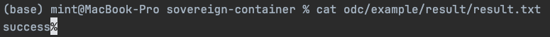
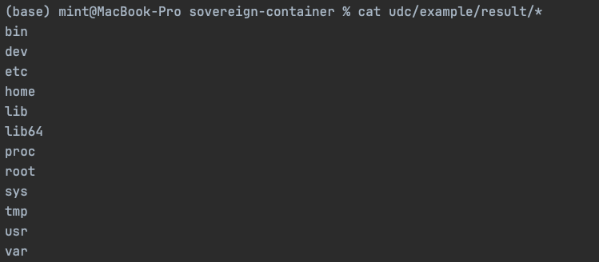

# sovereign-container

A framework that enables data owners to maintain data sovereignty during AI model training.

## 1. Build Instructions

### UDC Build
```bash
docker build -f udc/build/Dockerfile -t udc udc
```

### ODC Build
```bash
docker build -f odc/build/Dockerfile -t odc odc
```
---
## 2. Example Execution

Follow these steps in order. The example uses local build without pushing to container repository.

### Prerequisites - Download Test Model

```bash
sh udc/example/getTestModel.sh
```

### Run UDC Container

```bash
# Navigate to udc folder and return to maintain relative paths for compose example
cd udc/example && docker compose up -d && cd -

# Wait for NFS server
sleep 5
```

### Run ODC Container

```bash
# Navigate to odc folder and return to maintain relative paths for compose example
cd odc/example && docker compose up -d && cd -
```

### Check Execution Results

**Check ODC Execution Result**
```bash
cat odc/example/result/result.txt
```

If the file doesn't exist or doesn't contain "success", it indicates failure.

**Check UDC Execution Result**
```bash
cat udc/example/result/*
```

If the file doesn't exist or is empty, it indicates failure.

---
## 3. Configuration Changes

Configuration changes are explained based on the example compose files. When running docker commands directly, refer to the environment variables and volume settings below.

### ML Model Changes

You can either match the model filename to the default values or adjust the filename through environment variable settings.

#### Environment Variable Settings (Optional)

**UDC Configuration** - `udc/example/docker-compose.yml`
```yaml
environment:
  - MODEL_PATH=/{CUSTOM_PATH}/{MODEL_FILE_NAME}
  - MODEL_SCRIPT=/{CUSTOM_PATH}/{MODEL_SCRIPT_FILE_NAME}
volumes:
  - {LOCAL_DIR_PATH}:/{CUSTOM_PATH}/
```

**ODC Configuration** - `odc/example/docker-compose.yml`
```yaml
environment:
  - MODEL_SCRIPT=/{CUSTOM_PATH}/{MODEL_SCRIPT_FILE_NAME}
volumes:
  - {LOCAL_FILE_PATH}:/{CUSTOM_PATH}/{MODEL_SCRIPT_FILE_NAME}
```

#### File Changes (Required)

The following files need to be modified:

- **Model owner files**: `udc/example/model.tar`, `udc/example/script.sh`
- **Remote node execution script**: `odc/example/script.sh`

When directly integrating (not using examples), pay attention to the volume settings:

**UDC Volume Configuration** - `udc/example/docker-compose.yml`
```yaml
volumes:
  - {LOCAL_FILE_PATH}:/model/
```

**ODC Volume Configuration** - `odc/example/docker-compose.yml`
```yaml
volumes:
  - ./script.sh:/model/script.sh
```

### Authentication Management

Authentication considerations:

- Communication will be rejected if **UDC_ID** values differ
- Communication will be rejected if **ODC_ID** values differ
- Data decryption will fail if **OTP_SEED** values differ
- Communication will be rejected if **ODC_IP** is specified but differs
- Decryption will fail if client and server time differs by more than 3 minutes (default setting)

**UDC Authentication Settings** - `udc/example/docker-compose.yml`
```yaml
environment:
  - UDC_ID=ad296f2941dc4940e6f5056194135f83952ac4e4648541b200d6683427ce5cff
  - ODC_ID=f4bf87c7c91905b85d4577f181cd48a7b47ee2e390b1bbf46b956bf1747dd880
  - ODC_IP=
  - OTP_SEED=default_opt_seed
```

**ODC Authentication Settings** - `odc/example/docker-compose.yml`
```yaml
environment:
  - ODC_ID=f4bf87c7c91905b85d4577f181cd48a7b47ee2e390b1bbf46b956bf1747dd880
  - UDC_ID=ad296f2941dc4940e6f5056194135f83952ac4e4648541b200d6683427ce5cff
  - OTP_SEED=default_opt_seed
```

---
## 4. Running UDC and ODC in Remote Environments
TODO...

### Required Ports

| Port  | Service        | Description           |
|-------|----------------|-----------------------|
| 8080  | API Server     | REST API Server       |
| 111   | RPC Portmapper | Both TCP/UDP required |
| 2049  | NFS            | Both TCP/UDP required |
| 20048 | Mountd         | Both TCP/UDP required |

### Firewall Configuration Examples

**Ubuntu/Debian**
```bash
sudo ufw allow 8080/tcp
sudo ufw allow 111
sudo ufw allow 2049
sudo ufw allow 20048
```

**CentOS/RHEL**
```bash
sudo firewall-cmd --permanent --add-port=8080/tcp
sudo firewall-cmd --permanent --add-port=111/tcp
sudo firewall-cmd --permanent --add-port=111/udp
sudo firewall-cmd --permanent --add-port=2049/tcp
sudo firewall-cmd --permanent --add-port=2049/udp
sudo firewall-cmd --permanent --add-port=20048/tcp
sudo firewall-cmd --permanent --add-port=20048/udp
sudo firewall-cmd --reload
```